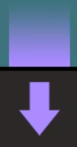
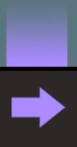
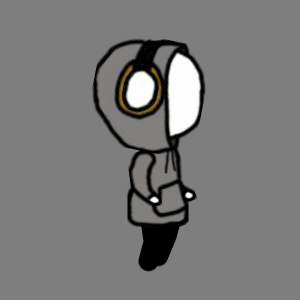
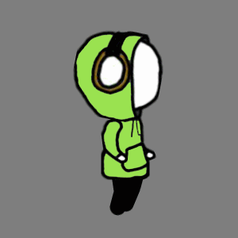
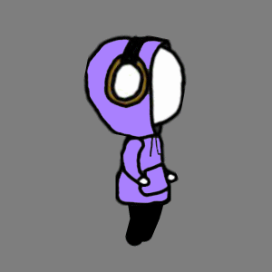
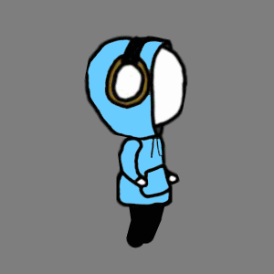
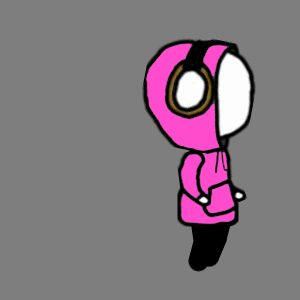
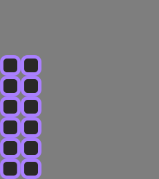

# -project-Fake_Escape

# Fake_Escape
2학년 2학기 '자바어플리케이션' 자유주제 기말 프로젝트

## <소개>
- Java의 이미지, 마우스, 키보드 이벤트 처리를 활용한 리듬게임
- 모티브 Melody's Escape https://store.steampowered.com/app/270210/Melodys_Escape/
- 음악에 맞춰서 생성된 음표(방향키)먹으면 캐릭터의 색상이 변하고, 리듬에 맞춰 모션(방향키) 눌러 장애물을 통과하는 리듬 게임
  
  ### 음표, 모션(방향키)
     
  - 방향키는 총 4종
  
     
  - 옳은 방향키를 입력시 캐릭터의 색상이 변하고 방향키가 확산하면서 사라지는 효과를 구현했다.
  - 15개의 이미지의 투명도와 크기를 조정하면서 이미지 출력
  
      

      
  - 모션키는 총 4종
  - 아직 눌러지지 않는 모션키는 바닥에서 빛이 나는 효과로 표현했다.
  
  ### 모션(캐릭터)
  - 포토샵과 애니메이트를 활용하여 작업하였다.
  - 모션마다 40개의 이미지로 구성, 모션마다 캐릭터의 출력 위치를 조정하여 움직임을 구현하였다.
    #### 달리기 모션(기본 모션)
    
    
    #### 발차기 모션
    
    
    #### 점프 모션
    
    
    #### 슬라이딩 모션
    
    
    #### 넘어지는 모션
    
    
  
  ### 배경, 장애물
    #### 벽, 벽이 깨지는 효과(발차기)
               
  ### 어려웠던점
  - 포토샵, 애니메이트 학습
  - 낮은 성능의 개발환경
  
## <개발환경>
- IDE : Eclipse
- Design : Adobe Photoshop, Adobe Animate
- Hardware : intel Pentium (laptops 4core 1.8Ghz), RAM 4GB

## <개발기간>
2017년 11월~12월(1달)
